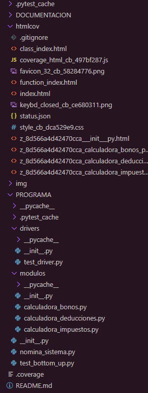
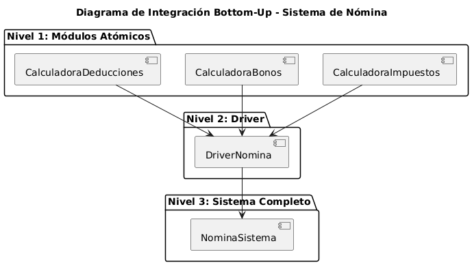
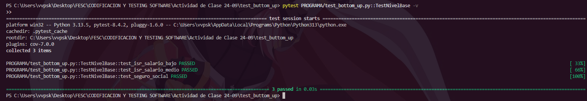
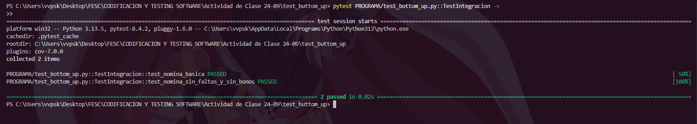
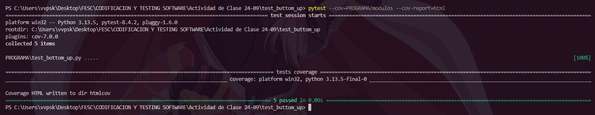

# Metodo
Este programa simula el cálculo de una nómina en una empresa, integrando los aspectos básicos que afectan al salario de un trabajador. Su propósito es mostrar, de manera práctica, cómo se aplican técnicas de pruebas de software con la estrategia Bottom-Up, empezando desde los módulos más pequeños hasta integrar el sistema completo.

# Infraestructura

## Reporte HTML Covertura
Este se encuentra en la carpeta htmlcov (Ejecutando "pytest --cov=PROGRAMA/modulos --cov-report=html" sin las comillas dobles, 
se obtiene este informe), se encuentra en el archivo index.html

## Diagrama

## Capturas

